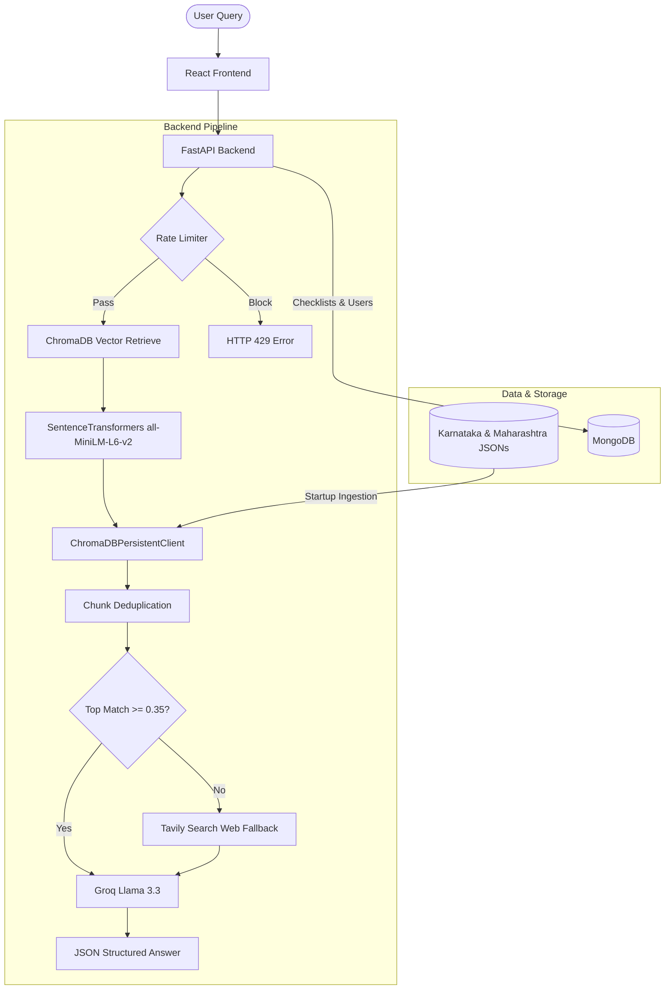

# PaperTrail V2 — System Architecture

This document describes the end-to-end technical architecture of PaperTrail V2.

---

## 1. Client Layer (Frontend)
- **Framework**: React 19, initialized using CRA + CRACO.
- **Styling**: Vanilla Tailwind CSS 3.
- **UI Components**: custom premium components (e.g. `SearchBar`, `ConfidenceBadge`) and custom skeletons.
- **Authentication**: Redirects to the Supabase Google OAuth provider directly via URL redirection, parses the redirected `access_token` from the URL hash in `AuthCallback.js`, and exchanges it with the backend `/api/auth/session` endpoint for a custom session cookie.

## 2. Server Layer (Backend)
- **Framework**: FastAPI (Python 3.12).
- **Database**: MongoDB (Async Motor driver) handles persistent storage for user accounts, active sessions, and saveable user checklists.
- **Rate Limiting**: Custom in-memory Token Bucket Limiter tracks client IP addresses and enforces a max capacity of 10 requests with 1-request replenishment every 6 seconds.
- **Prompt Injection Guard**: Strict regex-based sanitization strips instruction-like text from community notes before passing them to the Groq context.

## 3. RAG & Retrieval Layer
- **Embedding Model**: Local `sentence-transformers/all-MiniLM-L6-v2` runs locally without API costs. It encodes documents into 384-dimensional dense vectors.
- **Vector DB**: ChromaDB (`chromadb.PersistentClient`) stores vector indices in `backend/data/chroma`.
- **Deduplication**: Chunking splits each document into 3 logical chunks (`steps`, `required_documents`, `fees_office`). During retrieval, top 15 matches are queried, deduplicated by `doc_id`, and reconstructed to get the top `top_k` unique official/community docs.

## 4. LLM & Generation Layer
- **Model**: Groq Cloud's `llama-3.3-70b-versatile` generates answers based on user query and RAG context.
- **Web Fallback**: If the top retrieved document score falls below 0.35, Tavily Search is executed silently to inject real-time web context into the LLM prompt.
