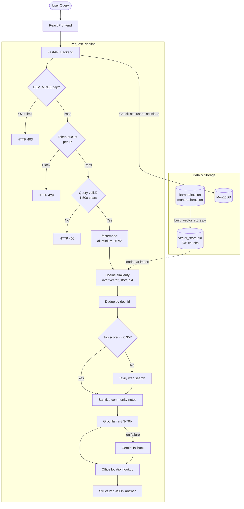

# PaperTrail V2 — System Architecture

This document describes the end-to-end technical architecture of PaperTrail V2 as it is
actually implemented. Where the code deliberately departs from the original MVP spec, the
reason is noted inline.

```mermaid
graph TD
    User([User Query]) --> FE[React Frontend]
    FE --> BE[FastAPI Backend]

    subgraph Request Pipeline
        BE --> DevCap{DEV_MODE cap?}
        DevCap -->|Over limit| Err403[HTTP 403]
        DevCap -->|Pass| RateLimit{Token bucket<br/>per IP}
        RateLimit -->|Block| Err429[HTTP 429]
        RateLimit -->|Pass| Validate{Query valid?<br/>1-500 chars}
        Validate -->|No| Err400[HTTP 400]
        Validate -->|Yes| QueryEmb[fastembed<br/>all-MiniLM-L6-v2]

        QueryEmb --> Retrieve[Cosine similarity<br/>over vector_store.pkl]
        Retrieve --> Dedup[Dedup by doc_id]

        Dedup --> CheckScore{Top score >= 0.35?}
        CheckScore -->|No| Tavily[Tavily web search]
        CheckScore -->|Yes| Sanitize[Sanitize community notes]
        Tavily --> Sanitize

        Sanitize --> LLM[Groq llama-3.3-70b]
        LLM -->|on failure| Gemini[Gemini fallback]
        LLM --> Loc[Office location lookup]
        Gemini --> Loc
        Loc --> GenResponse[Structured JSON answer]
    end

    subgraph Data & Storage
        ALL_DOCS[(karnataka.json<br/>maharashtra.json)]
        ALL_DOCS -->|build_vector_store.py| VS[(vector_store.pkl<br/>246 chunks)]
        VS -.loaded at import.-> Retrieve
        MongoDB[(MongoDB)]
        BE -->|Checklists, users, sessions| MongoDB
    end
```

---

## 1. Client Layer (Frontend)

- **Framework**: React 19, via CRA + CRACO (JavaScript/JSX — not TypeScript).
- **Styling**: Tailwind CSS 3, with Radix UI primitives and a `ThemeContext` for light/dark.
- **Routing**: `react-router-dom` across `/`, `/search`, `/doc/:id`, `/browse`, `/vision`,
  `/checklists`, `/auth/callback`.
- **Authentication**: Redirects to Supabase's Google OAuth provider, parses the returned
  `access_token` from the URL hash in `AuthCallback.js`, and exchanges it at
  `POST /api/auth/session` for an HTTP-only session cookie.

## 2. Server Layer (Backend)

- **Framework**: FastAPI (Python 3.12 locally; Render pins 3.11.9).
- **Database**: MongoDB via the async Motor driver — user accounts, sessions, and checklists.
- **Startup guard**: `server.py` exits immediately if `GROQ_API_KEY`, `SUPABASE_URL`, or
  `SUPABASE_ANON_KEY` are missing, rather than failing on the first request.
- **Rate limiting**: In-memory token bucket keyed by client IP — capacity 10, refilling at
  1 token per 6 seconds. State is per-process, so it resets on redeploy and does not
  coordinate across workers (`WEB_CONCURRENCY` is pinned to 1 in `render.yaml`).
- **Input validation**: Queries are trimmed, rejected if empty, capped at 500 characters,
  and must contain at least one word character.
- **DEV_MODE cap**: When `DEV_MODE=true`, each session is capped at 20 queries to protect
  free-tier API quotas during development.
- **Prompt-injection guard**: `sanitize_community_context()` regex-strips instruction-like
  phrasing from community-note text before it reaches the LLM. Official documents are not
  sanitized, since they are maintainer-curated.

## 3. RAG & Retrieval Layer

- **Corpus**: 82 curated documents — 41 Karnataka + 41 Maharashtra.
- **Chunking**: Each document becomes 3 chunks (`steps`, `required_documents`,
  `fees_office`), giving **246 vectors**. Splitting by field group keeps each embedding
  topically tight, so a "what documents do I need" query matches the docs chunk rather
  than diluting against fee and process text.
- **Embedding model**: `sentence-transformers/all-MiniLM-L6-v2` served through
  **fastembed**, which runs the ONNX build on CPU. Chosen over the `sentence-transformers`
  package because it avoids pulling in PyTorch — a ~2GB dependency that does not fit
  Render's free-tier build and memory budget. 384-dimensional vectors.
- **Vector store**: A prebuilt list of `{id, text, metadata, embedding}` dicts pickled to
  `backend/data/vector_store.pkl` and loaded into memory at module import. Retrieval is a
  NumPy cosine-similarity scan.

  > **Why not ChromaDB?** The MVP spec called for Chroma, and `backend/data/chroma/` is a
  > leftover from that attempt. Chroma's resident memory exceeded Render's free-tier limit
  > for a corpus this small. At 246 vectors a linear scan costs well under a millisecond,
  > so the dependency bought nothing. Revisit Chroma (or pgvector) when the corpus grows
  > past a few thousand chunks.

- **Filtering & dedup**: Results are filtered by `state` when supplied, then deduplicated
  by parent `doc_id` so three chunks of the same document don't crowd out other matches.
- **Build step**: The store is **not** generated at runtime. Run
  `python backend/scripts/build_vector_store.py` before deploying; startup only verifies
  the store is non-empty and logs a critical error if it isn't.

## 4. LLM & Generation Layer

- **Primary model**: Groq `llama-3.3-70b-versatile`, temperature 0.3, max 2048 tokens.
- **Fallback chain**: If the Groq call raises, `llm_call()` retries against Gemini, trying
  `gemini-2.0-flash`, `gemini-2.0-flash-lite`, `gemini-flash-lite-latest`, and
  `gemini-flash-latest` in order. This was added after the MVP spec was written (the spec
  deferred multi-LLM fallback to V2) because free-tier Groq rate limits were causing
  user-visible failures.
- **Output contract**: The model is asked for a strict JSON object — `summary`, `steps`,
  `required_documents`, `fees`, `processing_time`, `office_or_portal`, `tips`. Markdown
  fences are stripped before parsing, and a parse failure degrades to a minimal answer
  pointing at the top-matched document rather than erroring out.
- **Translation**: `POST /api/translate` runs LLM translation across 15 Indian languages
  on demand.

## 5. Web Fallback & Location Lookup

- **Silent web fallback**: When the top retrieval score is below **0.35**, Tavily is
  queried (restricted to `gov.in`, `nic.in`, `india.gov.in`) and the result is injected as
  supplementary context. The user is never told a fallback occurred.
- **Key rotation**: `TAVILY_KEYS` accepts comma-separated keys cycled round-robin, rotating
  on `429`/`432`/`403` to stretch free-tier quotas.
- **Office location**: For processes with a real offline path, `get_office_location()`
  runs a targeted Tavily search and passes the results through a strict extraction prompt.
  The prompt forbids inventing an address or phone number; if nothing concrete comes back,
  the response degrades to *"Search for your nearest [office] via [portal]"* and is labeled
  `UNVERIFIED`. Location confidence is scored **independently** of process confidence — see
  [`confidence-system.md`](confidence-system.md).

## 6. Known Gaps

- `scripts/reindex_notes.py` calls `collection.upsert(...)`, but `get_collection()` now
  returns a `MockCollection` exposing only `count()`. The community-note reindex path was
  not migrated when Chroma was removed, so the GitHub Action will fail on merge. Fixing
  this means rewriting the script to append to `vector_store.pkl` via `ingest.py`.
- Rate-limit and DEV_MODE counters are per-process in-memory dicts; they reset on restart
  and would need Redis to survive multiple workers.
